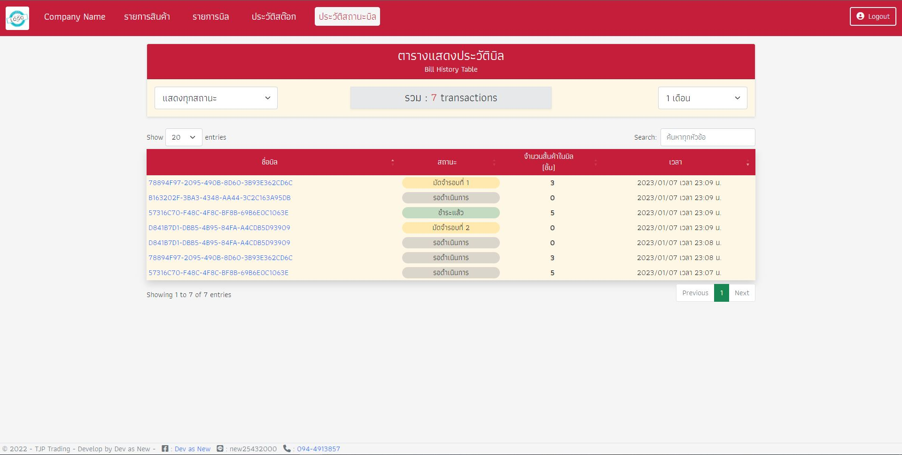

# Stock Management Project 🚀

Stock Management Project is an inventory management system for Gas retail station (SME). It has many useful functions for SME business such as stock management, POS build-in service, quotation and invoice report to .PDF and printer using C# .NET Core MVC and JavaScript.

Develop By [Dev as New](https://www.facebook.com/profile.php?id=100087205764882) freelance software developer.

# Preview

### Home Page

### Stock Page

### Create Stock

### Update Stock

### Bill Page

### Bill Create Page

### Bill Detail Page

### PO Page

### Invoice Page

### Stock History Page

### Bill History Page

